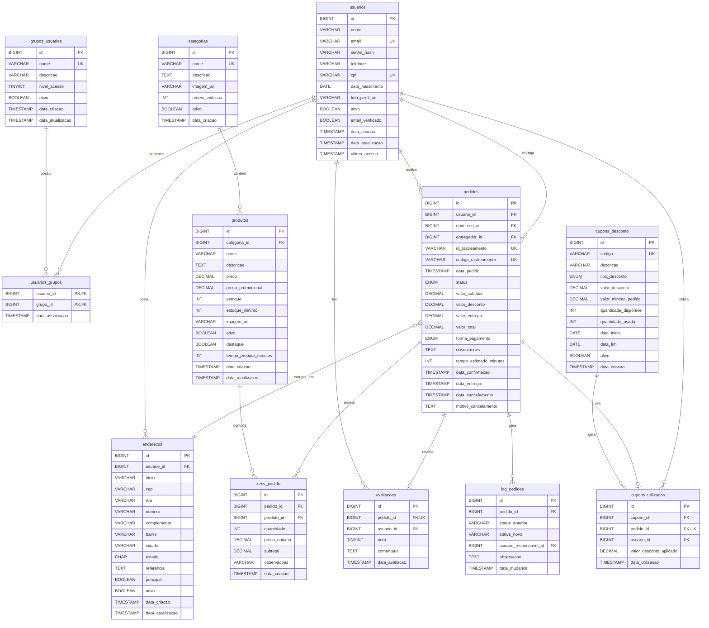

# Diagrama Entidade-Relacionamento (DER)
## Sistema de Delivery - Trabalho Acadêmico

---

## DER Completo (Mermaid)



---

## Descrição das Entidades

### 1. **grupos_usuarios**
- **Finalidade:** Armazena os perfis/grupos de usuários do sistema
- **Exemplos:** Cliente, Entregador, Gerente, Administrador
- **Relacionamentos:**
  - 1:N com `usuarios` (via `usuarios_grupos`)

### 2. **usuarios**
- **Finalidade:** Usuários do sistema (clientes, entregadores, gerentes, admins)
- **Autenticação:** Email + senha_hash (bcrypt)
- **Relacionamentos:**
  - N:M com `grupos_usuarios` (via `usuarios_grupos`)
  - 1:N com `enderecos`
  - 1:N com `pedidos` (como cliente)
  - 1:N com `pedidos` (como entregador)
  - 1:N com `avaliacoes`

### 3. **usuarios_grupos** (Tabela Associativa)
- **Finalidade:** Relacionamento N:N entre usuários e grupos
- **Permite:** Um usuário ter múltiplos perfis (ex: Cliente e Entregador)

### 4. **categorias**
- **Finalidade:** Categorias de produtos
- **Exemplos:** Pizzas, Hamburguer, Bebidas, Sobremesas
- **Relacionamentos:**
  - 1:N com `produtos`

### 5. **produtos**
- **Finalidade:** Produtos disponíveis para venda
- **Características:** Preço, estoque, tempo de preparo
- **Relacionamentos:**
  - N:1 com `categorias`
  - 1:N com `itens_pedido`

### 6. **enderecos**
- **Finalidade:** Endereços de entrega dos usuários
- **Permite:** Múltiplos endereços por usuário
- **Relacionamentos:**
  - N:1 com `usuarios`
  - 1:N com `pedidos`

### 7. **pedidos**
- **Finalidade:** Pedidos realizados no sistema
- **Status:** PENDENTE, CONFIRMADO, PREPARANDO, SAIU_ENTREGA, ENTREGUE, CANCELADO
- **Relacionamentos:**
  - N:1 com `usuarios` (cliente)
  - N:1 com `usuarios` (entregador)
  - N:1 com `enderecos`
  - 1:N com `itens_pedido`
  - 1:1 com `avaliacoes`
  - 1:N com `log_pedidos`

### 8. **itens_pedido**
- **Finalidade:** Itens individuais de cada pedido
- **Cálculo:** subtotal = quantidade * preco_unitario (via trigger)
- **Relacionamentos:**
  - N:1 com `pedidos`
  - N:1 com `produtos`

### 9. **avaliacoes**
- **Finalidade:** Avaliações dos pedidos pelos clientes
- **Nota:** 1 a 5 estrelas
- **Relacionamentos:**
  - 1:1 com `pedidos`
  - N:1 com `usuarios`

### 10. **log_pedidos**
- **Finalidade:** Auditoria de mudanças de status dos pedidos
- **Alimentação:** Automática via trigger
- **Relacionamentos:**
  - N:1 com `pedidos`
  - N:1 com `usuarios` (responsável pela mudança)

### 11. **cupons_desconto**
- **Finalidade:** Cupons de desconto/promoções
- **Tipos:** Percentual ou Valor Fixo
- **Relacionamentos:**
  - 1:N com `cupons_utilizados`

### 12. **cupons_utilizados**
- **Finalidade:** Registro de uso de cupons
- **Relacionamentos:**
  - N:1 com `cupons_desconto`
  - N:1 com `pedidos`
  - N:1 com `usuarios`

---

## Cardinalidades

### Relacionamentos Principais

| Entidade A | Cardinalidade | Entidade B | Descrição |
|-----------|---------------|-----------|------------|
| usuarios | 1:N | enderecos | Um usuário pode ter vários endereços |
| usuarios | N:M | grupos_usuarios | Um usuário pode ter vários grupos |
| categorias | 1:N | produtos | Uma categoria tem vários produtos |
| pedidos | 1:N | itens_pedido | Um pedido tem vários itens |
| produtos | 1:N | itens_pedido | Um produto pode estar em vários pedidos |
| usuarios | 1:N | pedidos | Um usuário (cliente) faz vários pedidos |
| usuarios | 1:N | pedidos | Um usuário (entregador) entrega vários pedidos |
| pedidos | 1:1 | avaliacoes | Um pedido tem no máximo uma avaliação |
| pedidos | 1:N | log_pedidos | Um pedido gera vários logs |

---

## Constraints e Regras de Negócio

### Primary Keys (PK)
Todas as tabelas possuem uma chave primária `id` (BIGINT AUTO_INCREMENT), exceto:
- `usuarios_grupos`: Chave composta (usuario_id, grupo_id)

### Foreign Keys (FK)
- **ON DELETE CASCADE:** itens_pedido, log_pedidos, usuarios_grupos, enderecos
- **ON DELETE RESTRICT:** produtos (categoria_id), pedidos (usuario_id, endereco_id)
- **ON DELETE SET NULL:** pedidos (entregador_id)

### Unique Keys (UK)
- `grupos_usuarios.nome`
- `usuarios.email`
- `usuarios.cpf`
- `categorias.nome`
- `pedidos.id_rastreamento`
- `pedidos.codigo_rastreamento`
- `avaliacoes.pedido_id`
- `cupons_desconto.codigo`

### Check Constraints
- `produtos.preco >= 0`
- `produtos.estoque >= 0`
- `pedidos.valor_total >= 0`
- `itens_pedido.quantidade > 0`
- `avaliacoes.nota BETWEEN 1 AND 5`

---

## Fluxo de Dados Principal

### 1. Cadastro de Usuário
```
Usuario se registra
  ->  INSERT em usuarios
  ->  INSERT em usuarios_grupos (associa ao grupo "Cliente")
```

### 2. Realização de Pedido
```
Cliente seleciona produtos
  ->  CALL sp_processar_pedido_completo()
    ->  INSERT em pedidos (trigger gera códigos de rastreamento)
    ->  INSERT em itens_pedido (trigger valida estoque, calcula subtotal)
      ->  Trigger atualiza estoque em produtos
      ->  Trigger atualiza valor_total em pedidos
    ->  INSERT em cupons_utilizados (se cupom aplicado)
```

### 3. Mudança de Status
```
Status do pedido muda
  ->  UPDATE pedidos SET status = 'PREPARANDO'
    ->  Trigger INSERT em log_pedidos (auditoria automática)
```

### 4. Entrega e Avaliação
```
Pedido entregue
  ->  UPDATE pedidos SET status = 'ENTREGUE', data_entrega = NOW()
    ->  Trigger registra em log_pedidos

Cliente avalia
  ->  INSERT em avaliacoes
```

---

## Normalização

### Forma Normal Atual: **3FN (Terceira Forma Normal)**

**Justificativa:**

1. **1FN (Primeira Forma Normal):**
   - OK: Todos os atributos são atômicos (sem listas ou arrays)
   - OK: Cada coluna contém um único valor

2. **2FN (Segunda Forma Normal):**
   - OK: Está em 1FN
   - OK: Todos os atributos não-chave dependem totalmente da chave primária

3. **3FN (Terceira Forma Normal):**
   - OK: Está em 2FN
   - OK: Nenhum atributo não-chave depende transitivamente de outro

**Exemplo de Normalização:**

ERRO: **Antes (Não Normalizado):**
```
pedidos: (id, usuario_nome, usuario_email, produto_nome, categoria_nome, ...)
```

OK: **Depois (3FN):**
```
usuarios: (id, nome, email)
pedidos: (id, usuario_id, ...)
itens_pedido: (id, pedido_id, produto_id, ...)
produtos: (id, nome, categoria_id, ...)
categorias: (id, nome)
```

---

## Otimizações Implementadas

### Desnormalização Controlada

**Campo `valor_total` em `pedidos`:**
- **Motivo:** Valor calculado (sum de itens_pedido.subtotal)
- **Justificativa:** Performance - evita SUM a cada consulta
- **Garantia:** Trigger mantém sincronizado automaticamente

**Campo `subtotal` em `itens_pedido`:**
- **Motivo:** Valor calculado (quantidade * preco_unitario)
- **Justificativa:** Performance e consistência
- **Garantia:** Trigger calcula automaticamente

### Views Materialized (Conceito)

Embora MySQL não suporte materialized views nativamente, as views criadas podem ser "materializadas" manualmente:

```sql
CREATE TABLE cache_vendas_por_categoria AS
SELECT * FROM vw_vendas_por_categoria;

-- Atualizar cache periodicamente (cron job)
TRUNCATE cache_vendas_por_categoria;
INSERT INTO cache_vendas_por_categoria
SELECT * FROM vw_vendas_por_categoria;
```

---

## Segurança e Auditoria

### Campos de Auditoria

Todas as tabelas principais possuem:
- `data_criacao` (TIMESTAMP)
- `data_atualizacao` (TIMESTAMP) - com ON UPDATE CURRENT_TIMESTAMP

### Log de Mudanças

Tabela `log_pedidos` registra:
- Status anterior e novo
- Usuário responsável
- Data/hora da mudança
- Observações

---

## Dicionário de Dados Completo

### Tabela: pedidos

| Coluna | Tipo | Nulo | Padrão | Descrição |
|--------|------|------|--------|------------|
| id | BIGINT | Não | AUTO_INCREMENT | Identificador único |
| usuario_id | BIGINT | Não | - | FK para usuarios (cliente) |
| endereco_id | BIGINT | Não | - | FK para enderecos |
| entregador_id | BIGINT | Sim | NULL | FK para usuarios (entregador) |
| id_rastreamento | VARCHAR(13) | Sim | NULL | Código legível (241118-000001) |
| codigo_rastreamento | VARCHAR(13) | Sim | NULL | Código alfanumérico (DLV-XXX) |
| data_pedido | TIMESTAMP | Não | CURRENT_TIMESTAMP | Data/hora do pedido |
| status | ENUM | Não | 'PENDENTE' | Status atual do pedido |
| valor_subtotal | DECIMAL(10,2) | Não | 0 | Soma dos itens |
| valor_desconto | DECIMAL(10,2) | Não | 0 | Descontos aplicados |
| valor_entrega | DECIMAL(10,2) | Não | 0 | Taxa de entrega |
| valor_total | DECIMAL(10,2) | Não | 0 | Total final |
| forma_pagamento | ENUM | Não | - | Método de pagamento |
| observacoes | TEXT | Sim | NULL | Observações do cliente |
| tempo_estimado_minutos | INT | Sim | NULL | Tempo estimado de entrega |
| data_confirmacao | TIMESTAMP | Sim | NULL | Quando foi confirmado |
| data_entrega | TIMESTAMP | Sim | NULL | Quando foi entregue |
| data_cancelamento | TIMESTAMP | Sim | NULL | Quando foi cancelado |
| motivo_cancelamento | TEXT | Sim | NULL | Motivo do cancelamento |

---

## Links Úteis

- [Documentação Completa do Banco](../database/README.md)
- [Scripts SQL](../database/mysql/)
- [Mermaid Live Editor](https://mermaid.live/) - Para visualizar o diagrama

---

**Desenvolvido para:** Trabalho Acadêmico - Banco de Dados II
**Versão:** 1.0
**Data:** Novembro 2024
